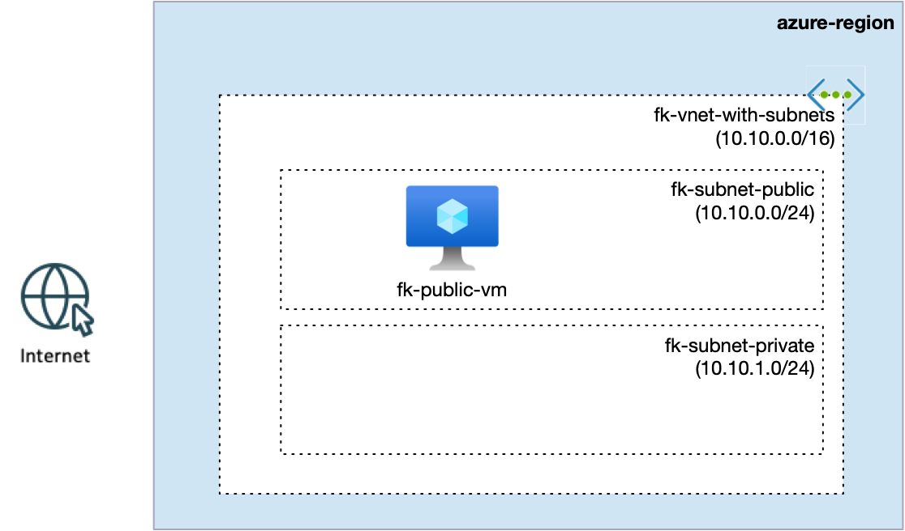
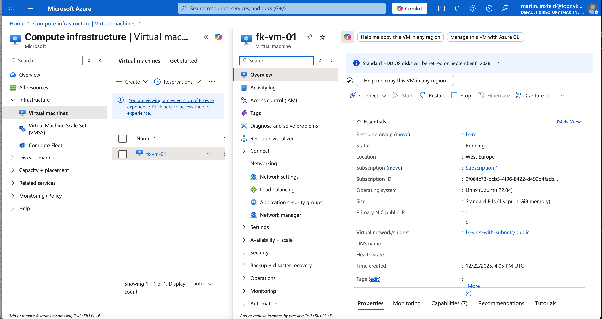

# Example 01: Single Azure Virtual Machine (Compute Basics)

In this first compute example, we deploy a **single Linux Virtual Machine** into an **existing Azure Virtual Network**
using **Terraform / OpenTofu**.

This example introduces the **compute layer** and is intentionally kept simple:
no autoscaling, no Load Balancer, no Network Security Groups.
Its only purpose is to establish a **clean, understandable baseline** for Azure VM provisioning.

---

## 🧭 Architecture Overview

This deployment assumes that a Virtual Network already exists
(e.g. created using the `terraform-az-fk-vnet` module in previous examples).

The VM is deployed into a **public subnet** and attached to a single network interface.



This example creates:
- A single **Linux Virtual Machine**
- A dedicated **Network Interface (NIC)**
- An OS disk attached to the VM
- No Load Balancer
- No autoscaling
- No Network Security Groups

This is a **compute-only foundation**, not a production-ready setup.

---

## 🎯 Why this example exists

Before introducing:
- autoscaling (VM Scale Sets),
- Load Balancers,
- NSGs,
- or advanced networking,

it is critical to understand **how a single VM is created, wired, and placed into a network**.

This example focuses on:
- VM lifecycle basics
- Network attachment (NIC → subnet)
- Clear separation between networking and compute responsibilities

---

## 🚀 Deployment Steps

```bash
tofu init
tofu plan
tofu apply
```

---

## 🖼️ Azure Portal View



*Figure 1. Single Azure Virtual Machine deployed into a custom VNet using Terraform/OpenTofu.*

---

## 🧹 Cleanup

```bash
tofu destroy
```

---

## 🪪 License

Licensed under the **Universal Permissive License (UPL), Version 1.0**.

