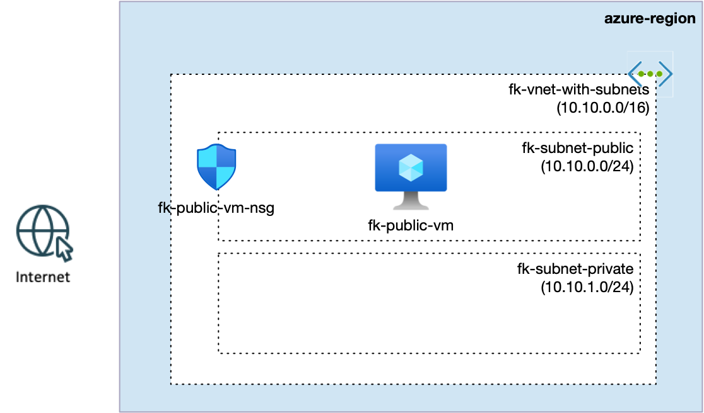

# Example 02: Single VM with Network Security Group (NSG)

In this example, we extend the compute baseline from Example 01 by adding a **Network Security Group (NSG)**
to control inbound traffic to the subnet hosting the VM.

This is the first step toward **secure-by-default** compute architectures on Azure.

---

## 🧭 Architecture Overview

This deployment assumes that a Virtual Network already exists
(e.g. created using the terraform-az-fk-vnet module in previous examples).

In this example, the VM is deployed into a public subnet and protected by a dedicated
Network Security Group (NSG) that controls inbound access.



This example creates:
- A single Linux Virtual Machine
- A dedicated Network Interface (NIC)
- A dedicated Network Security Group (NSG)
- An NSG association (applied directly to the NIC)
- An OS disk attached to the VM
- No Load Balancer
- No autoscaling

This is still a single-VM foundation, but now with explicit network security controls
— a required step before introducing Load Balancers, multiple instances, or VM Scale Sets.

---

## ⚙️ Inputs Worth Noting

- `ssh_source_cidrs` — controls who can reach TCP/22 (SSH).
  - For quick demos the default is `0.0.0.0/0`, but for real usage set it to your IP or corporate CIDR.
- `enable_http` — when set to `true`, opens TCP/80 for simple web demos.

---

## 🚀 Deployment Steps

```bash
cd examples/02_single_vm_with_nsg
tofu init
tofu plan
tofu apply
```

After apply, you should see outputs including:
- `nsg_id`
- `vm_id`
- `vm_private_ip`

---

## 🧹 Cleanup

```bash
tofu destroy
```

---

## ✅ Summary

This example demonstrates:

- How to attach an **NSG to a NIC** (`azurerm_network_interface_security_group_association`)
- How to implement a minimal inbound policy for a VM instance
- A clean foundation for the next steps:
  - Load Balancer frontends
  - VM Scale Sets (autoscaling)
  - Private-only access patterns (Bastion, Jumpbox)

---

## 🪪 License

Licensed under the **Universal Permissive License (UPL), Version 1.0**.  
See [LICENSE](../../LICENSE) for more details.
