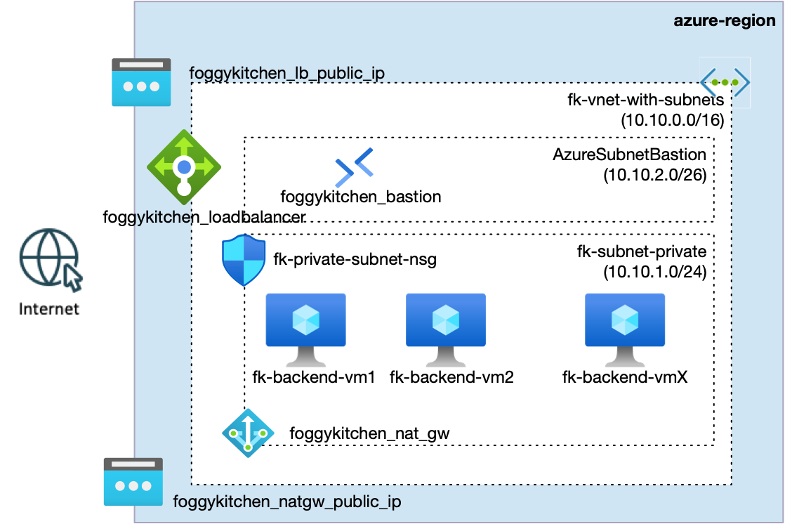
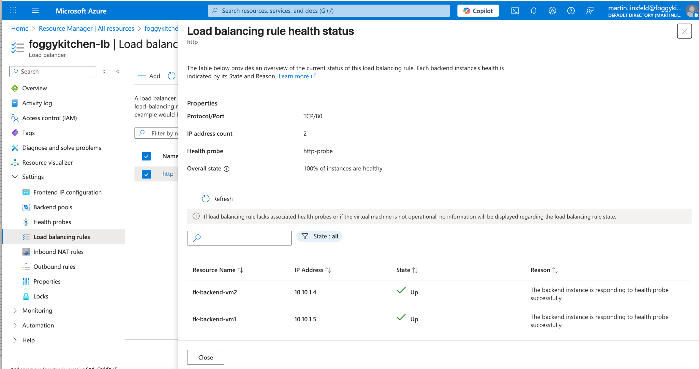
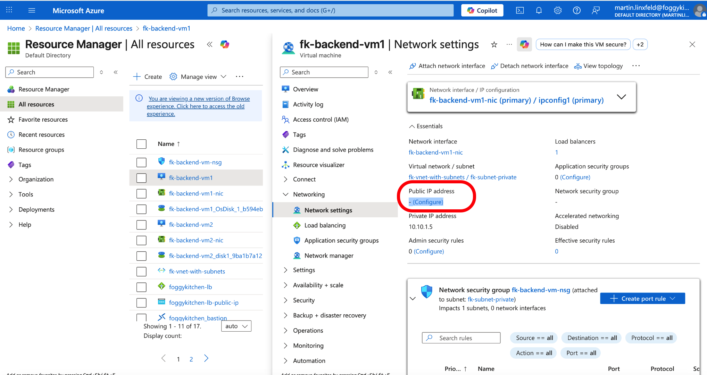
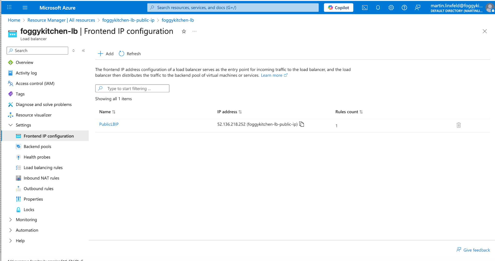
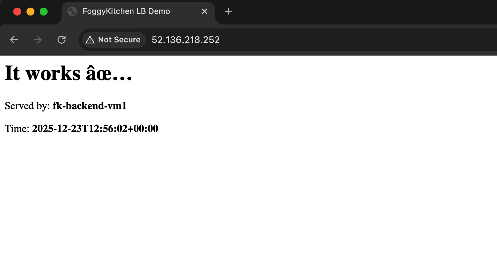

# Example 03: Multiple Virtual Machines behind Azure Load Balancer

This example demonstrates a **real-world Azure compute topology** where multiple
Linux Virtual Machines are deployed into a **private subnet** and exposed publicly
**only through an Azure Load Balancer**.

Administrative access to the VMs is provided via **Azure Bastion**, while outbound
internet access is handled by a **NAT Gateway**.

This example builds on previous networking foundations and introduces the first
**production-style traffic flow**.

---

## 🧭 Architecture Overview



**Figure 1.** Multiple backend VMs deployed in a private subnet, exposed via Azure Load Balancer, with secure access through Bastion and controlled outbound traffic via NAT Gateway.

---

## 🏗️ Architecture Description

This deployment assumes that a Virtual Network already exists
(e.g. created using the `terraform-az-fk-vnet` module).

The architecture consists of:

- A single **Azure Virtual Network**
- Three dedicated subnets:
  - `AzureBastionSubnet` (for Bastion)
  - `fk-subnet-private` (for backend VMs)
- An **Azure Load Balancer** (via `terraform-az-fk-loadbalancer`) with a public frontend IP
- Multiple **Linux Virtual Machines** (via `terraform-az-fk-compute`) deployed in the private subnet
- A **Network Security Group** (via `terraform-az-fk-nsg`) attached at the subnet level
- An **Azure Bastion Host** (via `terraform-az-fk-bastion`) for secure SSH access
- A **NAT Gateway** (via `terraform-az-fk-natgw`) providing controlled outbound internet access

---

## 🔀 Traffic Flow

### Inbound traffic (HTTP)

Internet → Public Load Balancer (TCP/80) → Backend Pool → Private VMs running NGINX

### Administrative access (SSH)

Operator → Azure Bastion → Private VM (SSH over private IP)

### Outbound traffic

Private VM → NAT Gateway → Internet

---

## 🧱 Security Model

- No public IPs on backend VMs
- NSG applied at the subnet level
- SSH allowed only from AzureBastionSubnet
- HTTP allowed only from Load Balancer
- Default deny for all other inbound traffic

---

## ⚙️ Compute Configuration

Each backend VM:
- Is deployed using the `terraform-az-fk-compute` module
- Uses cloud-init to install and configure **NGINX**
- Is registered in the Load Balancer backend pool (from `terraform-az-fk-loadbalancer`)
- Serves a demo HTML page identifying the VM hostname

---

## 🖼️ Azure Portal View

After deployment, you should see:

1. Load Balancer health probes reporting all backends as healthy



2. Backend VMs without public IPs



3. LoadBalancer Frontend IP



Accessing the Load Balancer public IP should display the NGINX demo page.



---

## 📚 Related Reading

This example is also covered in a dedicated architectural blog post:

**🔗 Private Azure Virtual Machines with Terraform — Load Balancer & Bastion (2026 Edition)**  
https://foggykitchen.com/2025/12/23/azure-private-vm-terraform/

The article explains the architecture behind this setup —  
why private VMs + Load Balancer + Bastion are a common baseline  
before moving toward autoscaling and Kubernetes workloads.

---

## 🔐 Accessing Backend VMs via Azure Bastion (SSH Tunnel)

In this example, **backend virtual machines do not have public IP addresses**.
All administrative access is performed securely using **Azure Bastion** and an **SSH tunnel**.

This approach ensures:
- No inbound SSH exposure to the Internet
- No public IPs on backend VMs
- Access fully scoped to Azure control plane and your identity

---

### 🧭 Access Flow Overview

1. Azure Bastion is deployed into the dedicated `AzureBastionSubnet`
2. A secure tunnel is established from your local machine → Azure Bastion
3. SSH traffic is forwarded through the tunnel to the private VM IP
4. Authentication uses the same SSH key pair provisioned by Terraform/OpenTofu

---

### 🚇 Step 1: Open an SSH Tunnel via Azure Bastion

Run the following command from your local terminal:

```bash
az network bastion tunnel \
  --name fk-bastion \
  --resource-group fk-rg \
  --target-resource-id $(az vm show -g fk-rg -n fk-backend-vm1 --query id -o tsv) \
  --resource-port 22 \
  --port 50022
```

You should see:

```text
Opening tunnel on port: 50022
Tunnel is ready, connect on port 50022
```

Keep this terminal window **open** — it maintains the tunnel.

---

### 🔑 Step 2: Prepare the SSH Private Key

The VM SSH key pair is generated by Terraform/OpenTofu.
Extract the private key (example using OpenTofu console):

```hcl
nonsensitive(tls_private_key.public_private_key_pair.private_key_openssh)
```

Save it locally as `id_rsa` and secure it:

```bash
chmod 600 id_rsa
```

---

### 🖥️ Step 3: Connect to the VM via SSH

In a **second terminal window**, connect through the tunnel:

```bash
ssh -i id_rsa -p 50022 azureuser@127.0.0.1
```

After accepting the host fingerprint, you should be logged into the VM:

```text
Welcome to Ubuntu 22.04 LTS
azureuser@fk-backend-vm1:~$
```

---

### ✅ Result

You now have:
- Secure SSH access to a **private backend VM**
- No public IP exposure
- Bastion-mediated access fully compliant with Azure security best practices

---

### 🧠 Why This Matters

This example demonstrates how:
- Load-balanced backend VMs can remain **fully private**
- Operational access does **not** require public endpoints
- Bastion integrates cleanly with Terraform-managed infrastructure

The same pattern scales naturally to:
- VM Scale Sets (VMSS)
- AKS node pools
- Multi-tier application architectures

---

## 🚀 Deployment Steps

```bash
tofu init
tofu plan
tofu apply
```

---

## 🧹 Cleanup

```bash
tofu destroy
```

---

## ✅ Summary

This example demonstrates:
- Multiple private VMs behind a Load Balancer
- Secure administrative access via Bastion
- Controlled outbound connectivity using NAT Gateway
- A production-style Azure compute topology

---

## 🪪 License

Licensed under the **Universal Permissive License (UPL), Version 1.0**.  
See [LICENSE](../../LICENSE) for details.

© 2025 FoggyKitchen.com — *Cloud. Code. Clarity.*
