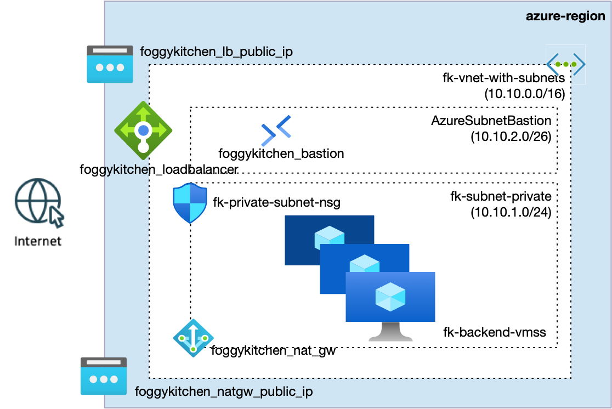
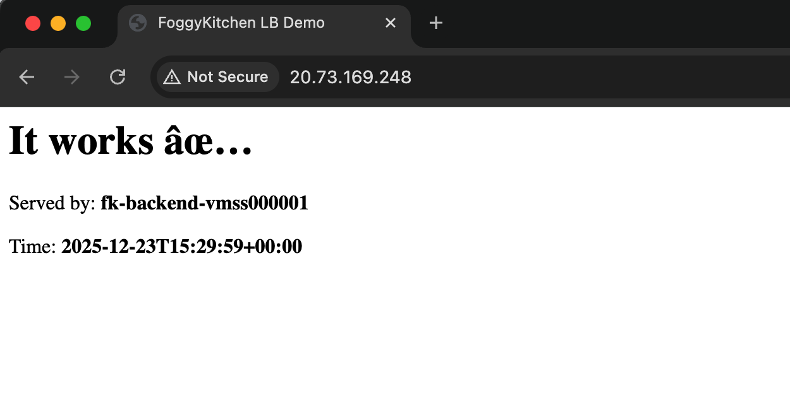
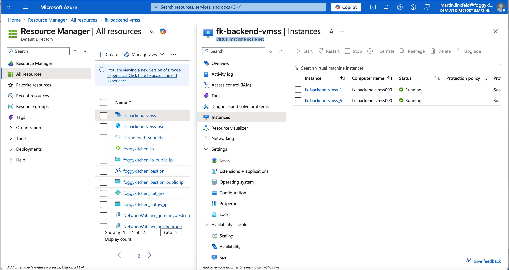
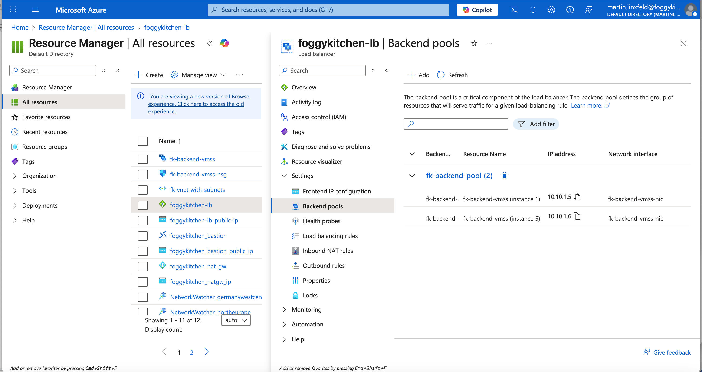

# Example 04: VM Scale Set with Autoscaling and Load Balancer

This example demonstrates how to deploy a **Virtual Machine Scale Set (VMSS)** behind an **Azure Load Balancer** using **Terraform/OpenTofu**.
It builds directly on the previous examples by replacing individually managed virtual machines with a **scalable, managed compute layer**.

The goal is to show how Azure-native scaling works **before** introducing AKS.

---

## 🧭 Architecture Overview



This deployment includes:

- A **Virtual Network** with multiple subnets (via `terraform-az-fk-vnet`)
- A **public Azure Load Balancer** (via `terraform-az-fk-loadbalancer`) with a frontend public IP
- A **VM Scale Set (VMSS)** deployed into a private subnet (via `terraform-az-fk-compute`)
- **NSG attached at subnet level** (via `terraform-az-fk-nsg`)
- **Azure Bastion** for secure SSH access (via `terraform-az-fk-bastion`)
- **NAT Gateway** (via `terraform-az-fk-natgw`) for outbound internet access
- **cloud-init**–based provisioning (NGINX)

Traffic flow:

Internet → Load Balancer → VMSS instances (NGINX)  
Admin access → Azure Bastion → private VMSS instances

---

## 🚀 Deployment Steps

```bash
cd examples/04_vmss_autoscaling
tofu init
tofu plan
tofu apply
```

---

## 🌐 Load Balancer Verification

Open the Load Balancer public IP in a browser:

```text
http://<lb_public_ip>
```



Refreshing the page may show a **different VMSS instance hostname**, confirming load distribution.

---

## 🖼️ Azure Portal View

### VM Scale Set instances



### Load Balancer backend pool



The backend pool (from `terraform-az-fk-loadbalancer`) is attached **directly to the VM Scale Set**.
Azure automatically manages backend membership as instances scale.

---

## 📚 Related blog post

For a step-by-step walkthrough of this VM Scale Set foundation, including architecture diagrams and Azure Portal verification, check out the companion article:

➡️ **Azure VM Scale Sets Autoscaling with Terraform — Private compute at scale (2026 Edition)**  
https://foggykitchen.com/2025/12/29/azure-vmss-autoscaling-terraform/

---


## 🔐 SSH access via Azure Bastion (VMSS instances)

This example deploys the backend as a **Virtual Machine Scale Set (VMSS)**.
Because VMSS instances do **not** have public IPs, the recommended way to reach them is
via **Azure Bastion tunneling**.

> ✅ Tip: In VMSS, you tunnel to a specific **instance**:
> `/virtualMachineScaleSets/<vmss-name>/virtualMachines/<instance-id>`

---

### 1) Start a Bastion tunnel to a VMSS instance

First, list your VMSS instance IDs (so you know which instance to target):

```bash
az vmss list-instances \
-g fk-rg \
-n fk-backend-vmss \
--query "[].instanceId" \
-o tsv
```

Pick one instance (for example `1`) and open a tunnel to port **22**:

```bash
az network bastion tunnel \
--name foggykitchen-bastion \
--resource-group fk-rg \
--target-resource-id $(az vmss show -g fk-rg -n fk-backend-vmss --query "id" -o tsv)/virtualMachines/1 \    
--resource-port 22 \
--port 50022
```

You should see:

```
Opening tunnel on port: 50022
Tunnel is ready, connect on port 50022
Ctrl + C to close.
```

Keep this command running in a dedicated terminal tab.

---

### 2) SSH to the VMSS instance through the tunnel

Use the same SSH private key you generated/used for this deployment (for example `id_rsa`):

```bash
chmod 600 id_rsa
ssh -i id_rsa -p 50022 azureuser@127.0.0.1
```

Once connected, you can verify which VMSS instance you landed on:

```bash
hostname
```

---

### 3) (Optional) Connect to a different VMSS instance

Stop the tunnel (**Ctrl+C**) and re-run it with a different instance id:

```bash
az network bastion tunnel \
--name fk-bastion \
--resource-group fk-rg \
--target-resource-id $(az vmss show -g fk-rg -n fk-backend-vmss --query "id" -o tsv)/virtualMachines/5 \ --resource-port 22 \
--port 50022
```

---

### Troubleshooting

- If SSH hangs: confirm the VMSS NSG allows **SSH from AzureBastionSubnet**.
- If you changed `upgrade_mode` to `Manual`, remember that instance configuration may require an upgrade to apply changes.

---

## 📈 Autoscaling Notes

This example starts with a fixed instance count for clarity.
Autoscaling rules (CPU, schedule, metrics) can be layered on top later.

---

## 🧹 Cleanup

```bash
tofu destroy
```

---

© 2025 FoggyKitchen.com — *Cloud. Code. Clarity.*
