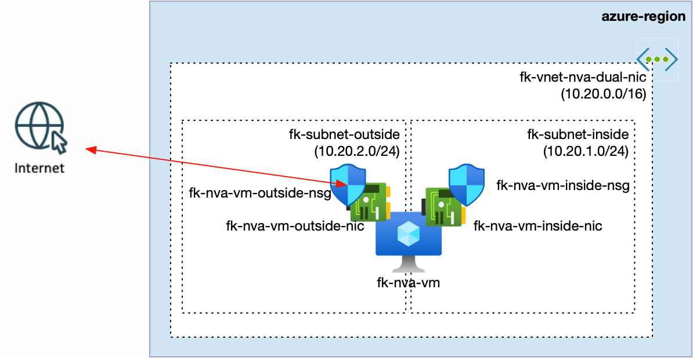
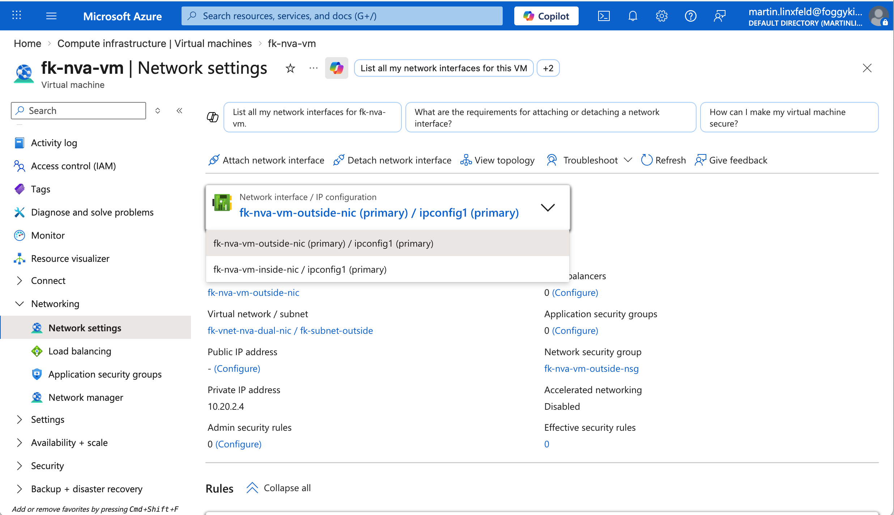

# Example 05: Dual-NIC NVA VM

This example demonstrates how to use **terraform-az-fk-compute** to deploy a **single Linux VM with multiple NICs**.

The goal here is intentionally narrow:

- show that the module can create **more than one NIC** for a single VM
- show how to choose the **primary NIC**
- show **static private IP** assignment per NIC
- show **NIC-level NSG association**
- show **IP forwarding** for router / NVA-style workloads

This example is a **compute-focused building block**, not a full transit-routing topology.  
For a larger hub/spoke routing scenario built on top of this capability, see the companion examples in `terraform-az-fk-routing`.

---

## Architecture Overview



This deployment creates:

- one Resource Group
- one VNet: `fk-vnet-nva-dual-nic`
- two subnets:
  - `fk-subnet-inside`
  - `fk-subnet-outside`
- one VM: `fk-nva-vm`
- two NICs attached to the same VM:
  - `fk-nva-vm-outside-nic` as the **primary** NIC
  - `fk-nva-vm-inside-nic` as the secondary NIC
- one NIC-level NSG for each interface

Default private IP layout:

- inside NIC: `10.20.1.4`
- outside NIC: `10.20.2.4`

Both NICs enable Azure NIC IP forwarding, while the guest OS also enables Linux IP forwarding through `custom_data`.

---

## Why This Example Exists

The earlier examples in this repository show:

- single-NIC VM deployment
- single-NIC VM with NSG
- multiple VMs behind a Load Balancer
- VMSS with autoscaling

What they do not show is the newer **multi-NIC VM path** in the module.

This example fills that gap by documenting the current API for:

- `network_interfaces`
- `primary = true`
- per-NIC static private IPs
- per-NIC NSG attachment
- per-NIC `enable_ip_forwarding`

---

## Deployment Steps

```bash
cd examples/05_nva_dual_nic_vm
cp terraform.tfvars.example terraform.tfvars
tofu init
tofu plan
tofu apply
```

---

## Key Module Pattern

The core of this example is the `network_interfaces` map:

```hcl
network_interfaces = {
  outside = {
    subnet_id                     = module.vnet.subnet_ids["fk-subnet-outside"]
    private_ip_address_allocation = "Static"
    private_ip_address            = "10.20.2.4"
    enable_ip_forwarding          = true
    attach_nsg_to_nic             = true
    nsg_id                        = module.nsg_outside.id
    primary                       = true
  }
  inside = {
    subnet_id                     = module.vnet.subnet_ids["fk-subnet-inside"]
    private_ip_address_allocation = "Static"
    private_ip_address            = "10.20.1.4"
    enable_ip_forwarding          = true
    attach_nsg_to_nic             = true
    nsg_id                        = module.nsg_inside.id
    primary                       = false
  }
}
```

Important behavior:

- exactly one NIC must be marked with `primary = true`
- the primary NIC becomes the VM primary interface in Azure
- `vm_private_ip` returns the IP of the primary NIC
- `vm_private_ips` and `vm_nic_ids` return all NICs as maps

---

## Validation Ideas

After deployment, you can validate:

- the VM has two NICs attached in Azure Portal
- the outside NIC is the primary NIC
- both NICs have the expected static private IPs
- both NICs have NIC-level NSGs associated
- Linux guest forwarding is enabled:

```bash
az vm run-command invoke \
  -g fk-rg \
  -n fk-nva-vm \
  --command-id RunShellScript \
  --scripts "ip -o -4 addr show; ip route; sysctl net.ipv4.ip_forward net.ipv4.conf.all.rp_filter net.ipv4.conf.default.rp_filter"
```

---

## Validated Result

This example was validated after a successful `tofu apply` by using Azure CLI `Run Command`.

Confirmed on `fk-nva-vm`:

- `eth0 = 10.20.2.4/24`
- `eth1 = 10.20.1.4/24`
- default route via `10.20.2.1 dev eth0`
- `net.ipv4.ip_forward = 1`
- `net.ipv4.conf.all.rp_filter = 0`
- `net.ipv4.conf.default.rp_filter = 0`

This confirms:

- the VM was provisioned with two NICs
- the `outside` NIC became the primary NIC
- both static private IP assignments were applied correctly
- Linux guest forwarding was enabled as intended for NVA-style workloads

---

## Azure Portal Verification

The following screenshot documents the dual-NIC configuration of `fk-nva-vm` in Azure Portal.



The screenshot confirms:

- `fk-nva-vm-outside-nic` is attached as the primary NIC
- `fk-nva-vm-inside-nic` is attached as the secondary NIC
- both interfaces are attached to the same VM
- the VM matches the intended multi-NIC module design shown in this example

---

## What This Example Does Not Do

This example intentionally does not include:

- hub/spoke peering
- UDR / route tables
- NAT Gateway
- Bastion
- internet egress validation

Those belong to larger, integration-oriented networking examples rather than the core compute module.

---

## Cleanup

```bash
tofu destroy
```
