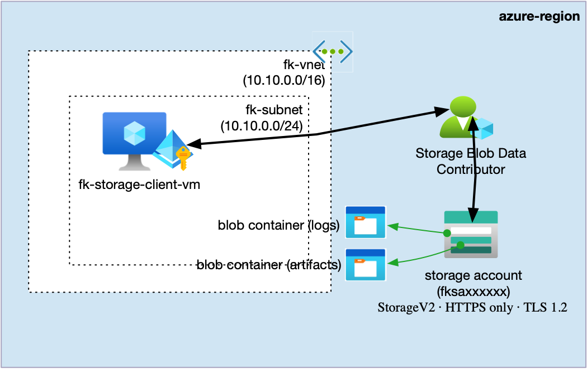
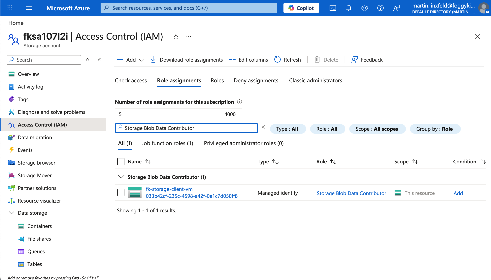
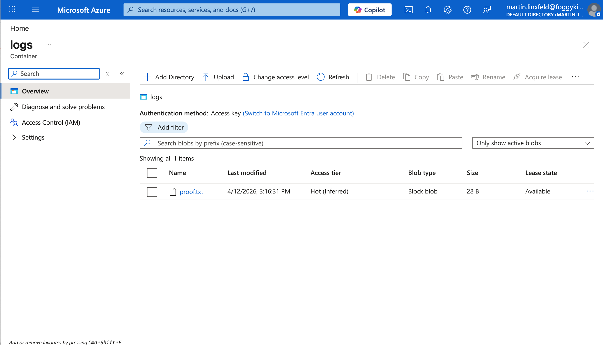

# Example 06: VM Managed Identity Access To Blob Storage

In this compute example, we move from a standalone Virtual Machine deployment
to a **real integrated scenario** where a Linux VM uses
its **system-assigned managed identity** to write data to Azure Blob Storage.

This example focuses on **managed identity as a compute capability**
while still deploying the minimal infrastructure required to prove the result end-to-end.

---

## 🧭 Architecture Overview

This deployment creates a single Linux VM,
a single Storage Account with Blob Containers,
and an RBAC role assignment that allows the VM identity to access Blob Storage.

The VM is created with a **system-assigned managed identity**
through the `terraform-az-fk-compute` module.
That identity receives the **Storage Blob Data Contributor** role
on the Storage Account scope through the `terraform-az-fk-rbac` module.



This example creates:
- One **Resource Group**
- One **Virtual Network** with a single subnet via `terraform-az-fk-vnet`
- One **Linux Virtual Machine** via `terraform-az-fk-compute`
- One **Storage Account (StorageV2)** via `terraform-az-fk-storage`
- Two **private Blob Containers** (`artifacts`, `logs`) via `terraform-az-fk-storage`
- One **RBAC role assignment** via `terraform-az-fk-rbac`
- Cloud-init setup that installs **Azure CLI** and prepares a helper upload script on the VM

This is a **compute + managed identity integration example**, not a full production landing zone.

---

## 🎯 Why this example exists

The purpose of this example is to show how managed identity should be treated
as a **native compute feature** instead of an afterthought added outside the VM design.

This example focuses on:
- Understanding how the compute module enables a system-assigned managed identity
- Understanding how workloads on the VM can consume that identity with `az login --identity`
- Understanding how the identity is then connected to a target resource scope through RBAC
- Proving the result by uploading a blob from inside the VM

The example deliberately keeps networking simple so the first managed identity scenario stays easy to follow.

---

## 🔐 About Access In This Example

This example demonstrates **managed identity + RBAC**, not private networking.

Important:
- the Blob service is reached through the **public Storage endpoint**
- the blob containers are still **private**
- access is granted through **managed identity + Azure RBAC**
- anonymous access is **not** enabled

This keeps the example focused on **compute identity and authorization wiring**.

More advanced patterns such as:
- Private Endpoints
- Private DNS
- storage firewall lockdown

can be layered on top later, but are intentionally out of scope here.

---

## 🚀 Deployment Steps

From the `examples/06_vm_managed_identity_blob_access` directory:

```bash
cp terraform.tfvars.example terraform.tfvars
tofu init
tofu plan
tofu apply
```

---

## ✅ Managed Identity Validation

This example prepares the VM for a real blob upload test,
but it does not perform the upload automatically during boot.

That is intentional:
- managed identity role assignments can take time to propagate
- forcing the upload inside cloud-init would make the example less deterministic

Instead, cloud-init:
- installs `azure-cli`
- creates `/usr/local/bin/blob-proof.sh`

After `tofu apply`, you can trigger the upload from your workstation with Azure CLI:

```bash
RESOURCE_GROUP_NAME="$(tofu output -raw resource_group_name)"
VM_NAME="$(tofu output -raw vm_name)"
STORAGE_ACCOUNT_NAME="$(tofu output -raw storage_account_name)"

az vm run-command invoke \
  --resource-group "${RESOURCE_GROUP_NAME}" \
  --name "${VM_NAME}" \
  --command-id RunShellScript \
  --scripts "/usr/local/bin/blob-proof.sh ${STORAGE_ACCOUNT_NAME} logs proof.txt 'hello from managed identity'"
```

Then verify that the blob exists:

```bash
ACCOUNT_KEY="$(tofu output -raw storage_primary_access_key)"
STORAGE_ACCOUNT_NAME="$(tofu output -raw storage_account_name)"

az storage blob list \
  --account-name "${STORAGE_ACCOUNT_NAME}" \
  --account-key "${ACCOUNT_KEY}" \
  --container-name logs \
  --output table
```

---

## 🖼️ Azure Portal View

The screenshots below capture the same scenario in the Azure Portal.



*Figure 1. `Storage Blob Data Contributor` assigned to the VM managed identity on the Storage Account scope.*



*Figure 2. `proof.txt` uploaded to the `logs` container after the managed identity validation step.*

---

## 🔧 Key Compute Wiring

```hcl
module "compute" {
  source = "../../"

  deployment_mode = "vm"
  identity_type   = "SystemAssigned"
  custom_data     = filebase64("${path.module}/cloud-init-blob-client.yaml")
}
```

The `identity_type = "SystemAssigned"` input is the key compute capability in this example.
It allows the VM to authenticate to Azure services without embedded credentials.

---

## 🧹 Cleanup

```bash
tofu destroy
```

---

## 🪪 License

Licensed under the **Universal Permissive License (UPL), Version 1.0**.  
See [LICENSE](../../LICENSE) for details.
